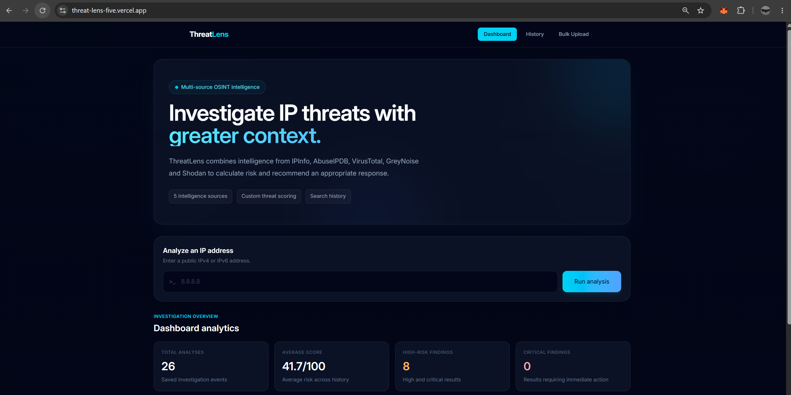
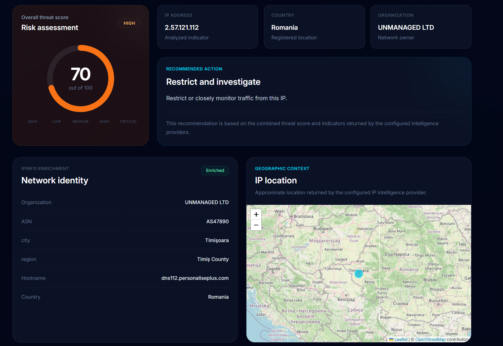
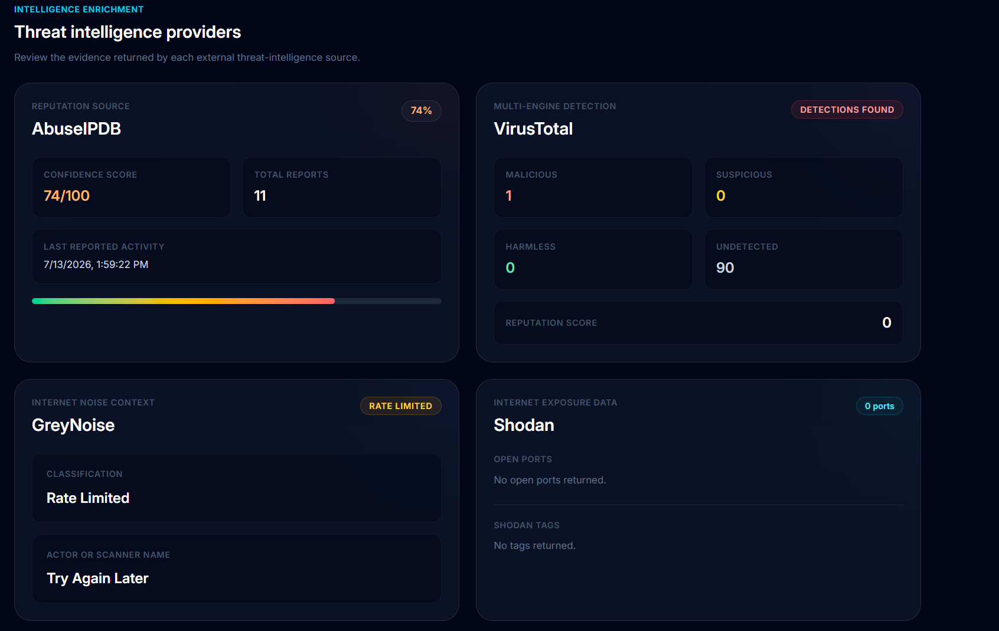
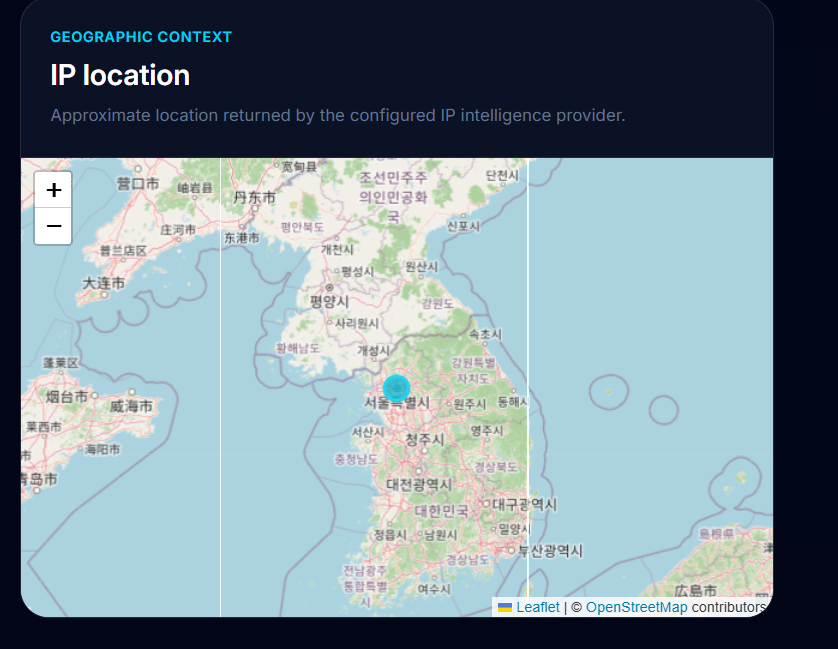
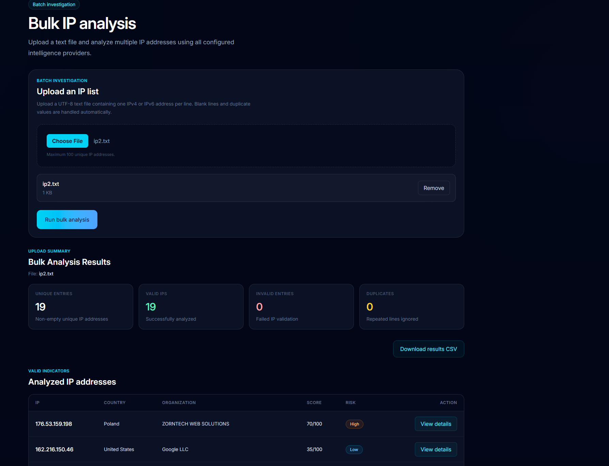
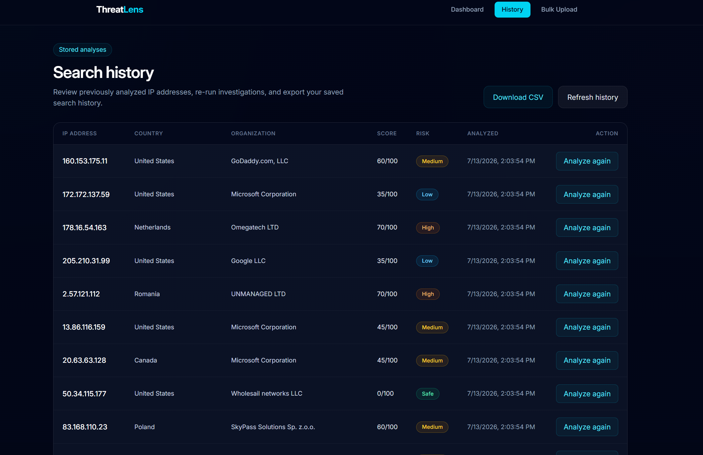
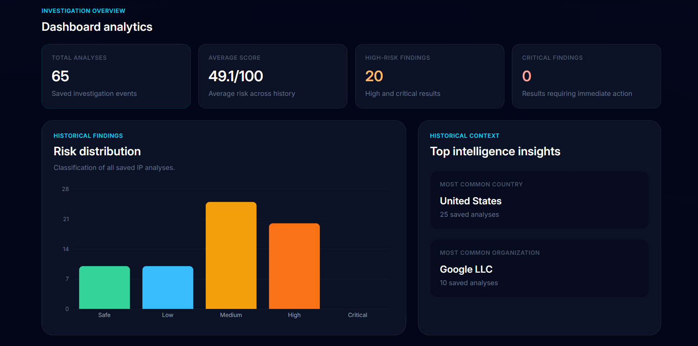
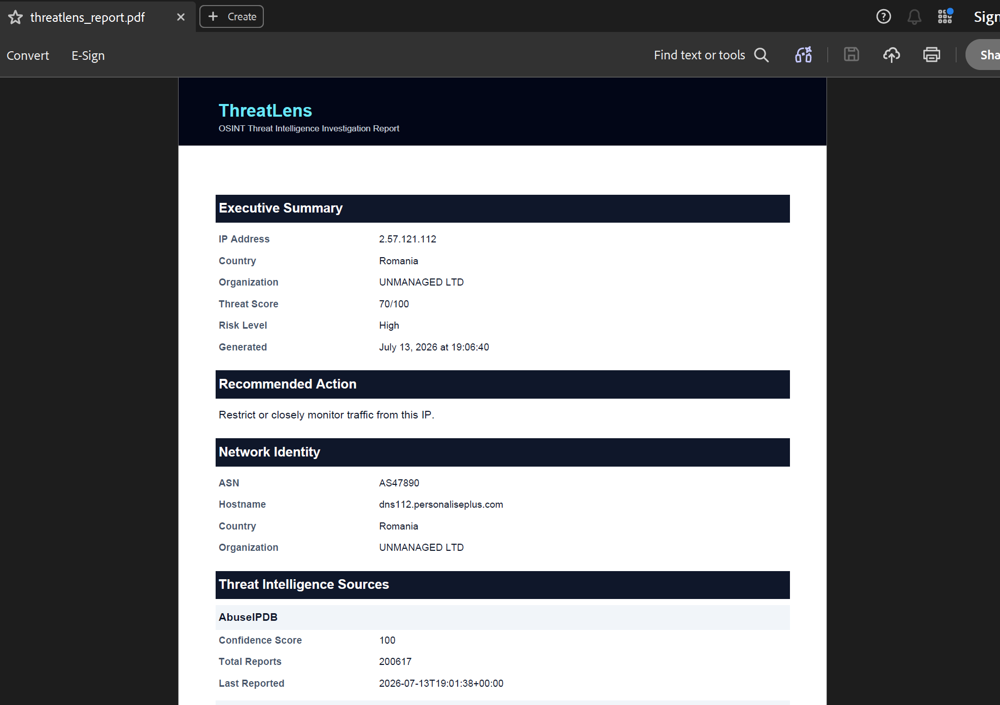
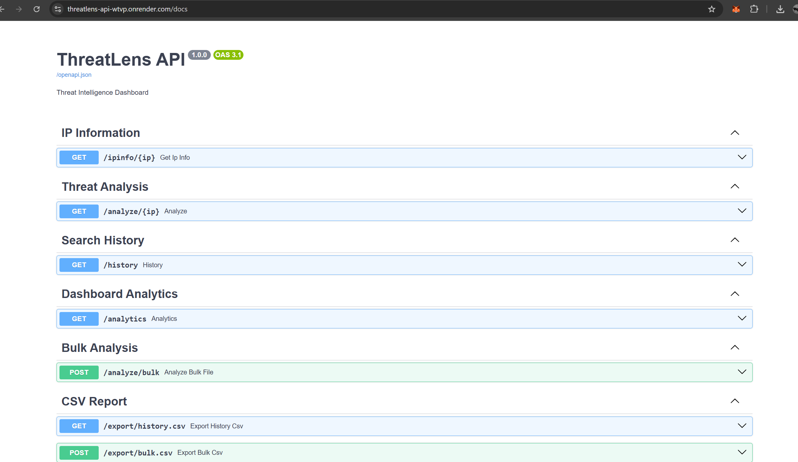

# 🛡️ ThreatLens

<p align="center">

**A Full-Stack Threat Intelligence Dashboard for IP Investigation**

Aggregate intelligence from multiple OSINT providers, calculate custom threat scores, visualize geolocation, and generate downloadable investigation reports—all from a single interface.

</p>

---

## 🌐 Live Demo

**Frontend:** https://threat-lens-five.vercel.app/

**Backend API:** https://threatlens-api-wtvp.onrender.com/

**API Documentation (Swagger):**
https://threatlens-api-wtvp.onrender.com/docs

---

# Dashboard Preview

> 

```text
docs/screenshots/dashboard.png
```

---

# Features

ThreatLens combines multiple threat intelligence providers into a single investigation workflow.

### 🔍 Threat Intelligence

- Multi-source IP enrichment
- Custom threat scoring engine
- Risk classification (Safe / Low / Medium / High / Critical)
- Actionable security recommendations

### 🌎 Network Intelligence

- Geolocation lookup
- Interactive Leaflet map
- ASN information
- Organization lookup
- Hostname resolution

### 📊 Investigation Tools

- Historical search tracking
- Re-analyze previous investigations
- Analytics dashboard
- Bulk IP analysis
- CSV export
- PDF report generation

### 🎨 User Experience

- Modern responsive UI
- Dark cybersecurity theme
- Interactive visualizations
- Real-time analysis

---

# Supported Intelligence Providers

| Provider | Purpose |
|----------|----------|
| IPInfo | Geolocation, ASN, Organization |
| AbuseIPDB | Abuse reports and confidence score |
| VirusTotal | Malware and reputation analysis |
| GreyNoise | Internet background noise classification |
| Shodan | Open ports and exposed services |

---

# Architecture

```text
                    React + TypeScript
                           │
                           ▼
                 FastAPI REST Backend
                           │
                           ▼
                 Threat Scoring Engine
                           │
      ┌──────────┬──────────┬──────────┬──────────┐
      ▼          ▼          ▼          ▼          ▼
   IPInfo   AbuseIPDB  VirusTotal  GreyNoise   Shodan
                           │
                           ▼
                  PostgreSQL (Neon)
```

---

# Technology Stack

## Frontend

- React
- TypeScript
- Vite
- Tailwind CSS
- React Leaflet
- React Router

## Backend

- FastAPI
- SQLAlchemy
- Pydantic

## Database

- PostgreSQL (Neon)

## Deployment

- Vercel
- Render

## External APIs

- IPInfo
- AbuseIPDB
- VirusTotal
- GreyNoise
- Shodan

---

# Threat Scoring

ThreatLens combines multiple intelligence sources into a single numerical risk score.

The scoring engine evaluates:

- Abuse confidence
- Malware detections
- Suspicious indicators
- Internet scanning activity
- Open services
- Exposed infrastructure

Based on these indicators, ThreatLens assigns one of five risk levels:

| Score | Risk |
|--------|------|
| 0–20 | 🟢 Safe |
| 21–40 | 🟡 Low |
| 41–60 | 🟠 Medium |
| 61–80 | 🔴 High |
| 81–100 | ⚫ Critical |

---

# Screenshots

## Dashboard


---

## Investigation Results Threat Score and Recommendations



---

## Threat Intelligence Providers



---

## Interactive Map




---

## Bulk Analysis



---

## Investigation History



---

## Analytics Dashboard



---

## PDF Report



## Swagger API




---

# Project Structure

```text
ThreatLens
│
├── backend
│   ├── api
│   ├── database
│   ├── schemas
│   ├── services
│   ├── config.py
│   └── main.py
│
├── frontend
│   ├── components
│   ├── pages
│   ├── services
│   ├── hooks
│   ├── types
│   └── assets
│
├── docs
│
└── README.md
```

---

# Local Installation

Clone the repository.

```bash
git clone https://github.com/YOUR_USERNAME/ThreatLens.git
```

Move into the project.

```bash
cd ThreatLens
```

---

## Backend

```bash
cd backend

python -m venv venv

source venv/bin/activate

pip install -r requirements.txt

uvicorn app.main:app --reload
```

Backend runs on

```
http://localhost:8000
```

Swagger

```
http://localhost:8000/docs
```

---

## Frontend

```bash
cd frontend

npm install

npm run dev
```

Frontend runs on

```
http://localhost:5173
```

---

# Environment Variables

Backend

```env
DATABASE_URL=

IPINFO_TOKEN=

ABUSEIPDB_API_KEY=

VIRUSTOTAL_API_KEY=

GREYNOISE_API_KEY=

SHODAN_API_KEY=
```

Frontend

```env
VITE_API_BASE_URL=
```

---

# Future Improvements

- IOC analysis (Domains, URLs, Hashes)
- AI-assisted investigation summaries
- User authentication
- Threat feed integrations
- Docker deployment
- SIEM integration
- Scheduled intelligence reports
- Real-time monitoring
- Threat actor attribution

---

# Why I Built ThreatLens

Threat analysts often need to query multiple intelligence platforms individually, making investigations repetitive and time-consuming.

ThreatLens streamlines this workflow by aggregating intelligence from multiple providers into a single dashboard, automatically calculating a threat score, visualizing geolocation, and generating investigation reports.

The project demonstrates full-stack development, API integration, cybersecurity concepts, data visualization, and cloud deployment.

---

# Author

## Samreen Kazi

MS Information Technology & Management  
Specialization in Computer & Information Security  
Illinois Institute of Technology

GitHub:
https://github.com/Samreen-Kazi

Portfolio:
https://YOUR-PORTFOLIO

---

## License

This project is licensed under the MIT License.
